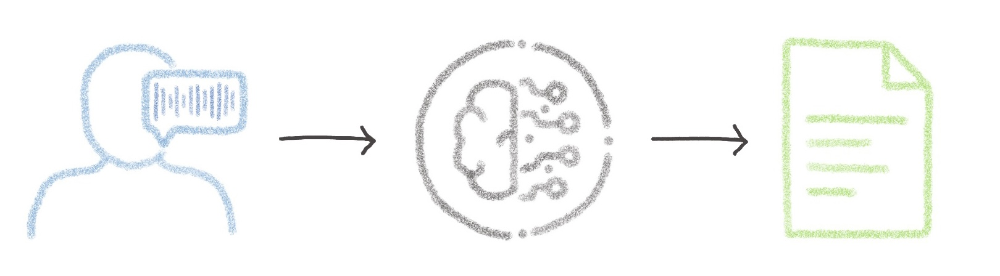
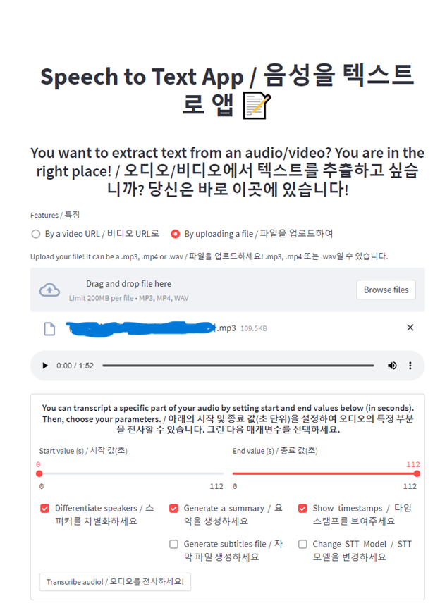

# Tutorial - Create a Speech to Text application using Streamlit



### Overview of the Speech to text app:
[](https://youtu.be/R_CjNtPLw7M)

## Requirements

- If you want the diarization option (speakers differentiation), you will need an access token. This token will be requested at the launch of the application. To create your token, follow the steps indicated on the [model page](https://huggingface.co/pyannote/speaker-diarization). If the token is not specified, the application will be launched without this feature.


## Instructions

### Write the requirements.txt file for the application

The `requirements.txt` file will allow us to write all the modules needed by our application. 
Put this file in the same directory as your python scripts.

```console
librosa==0.9.1
yt-dlp
streamlit
numpy==1.23
protobuf==3.20.1
tqdm
more-itertools
transformers>=4.19.0
ffmpeg-python
torch==1.11.0
networkx==2.6
pytorch-lightning==1.6.5
soundfile==0.10.2
tokenizers==0.12.1
pyannote.audio==2.1.1
pyannote.core==4.4
pydub==0.25.1
sentencepiece==0.1.96
torchmetrics
torchtext==0.12.0
torchvision==0.12.0
torchaudio==0.11.0
datasets
```

Use a `pip install ...` command to install our needed python modules that are in the `requirements.txt` file:

```console
RUN pip install -r requirements.txt
```

Once your environment is set up, define your default launching command to start the application:

```console
CMD [ "streamlit" , "run" , "main.py", "--server.address=0.0.0.0" ]
```

### Import the models and save them locally (Optional)

You will considerably reduce the initialization time of the app if you download the models and store them in a local folder. This will allow you not to have to download them again every time you relaunch the application. 

*Unfortunately, the diarization model can't be saved anymore since pyannote.audio v2. Make sure you have replaced the `use_auth_token="ACCESS TOKEN GOES HERE"` code line in the app.py file by your own token so it can download the model. If the model fails to be downloaded during the initialization of the app, the diarization option will be disabled.*
